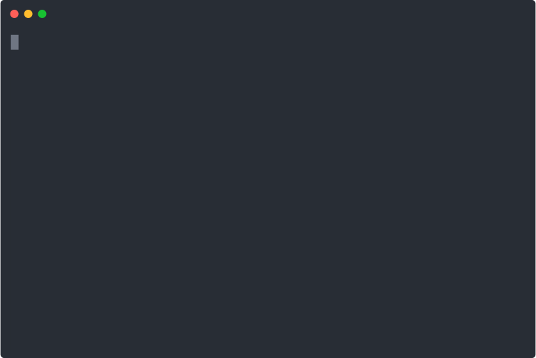

Brain Games
============

Description
-----------
Brain Games includes compilation of 5 games that allows you to check your brain power and test your skills in calculations.
You'll get the short instruction of every game after starting the game.
Every game consists of three  rounds. To win the game you should give the correct answers for every round.
If you give the wrong answer the game ends and you may try again with starting new game if you wish.

Installing
----------
Clone repository from https://github.com/aktm1982/php-project-lvl1.git to any folder on your hard drive.
Switch to created folder and perform "make install" using terminal to install missing dependencies.

Playing the games
-----------------
To start the games use the following commands in terminal using "make" utility

Brain-Even Game: 
use command "make brain-even"

Brain-Calc Game: 
use command "make brain-calc"

Brain-GCD game: 
use command "make brain-gcd"

Brain-Progression game: 
use command "make brain-progression"

Brain-Prime game: 
use command "make brain-prime"

Adding new game
---------------
1. Create new directory in "src/Games" folder.
2. Put new script file into this directory.
3. Add instruction "use function Brain\Engine\runGame" just after "<?php" line in your script file.
4. Add function recall "runGame()" to the end of your script.
5. Now you should pass two arguments to the "runGame()" recall:
   - array with two keys: "question" - the line wich will be shown as the question at the start of every round, "correctAnswer" - the correct answer which is assumed to be equal with the user input;
   - instruction string which will be shown at the start of the game.
6. Run your script and play the game.

Deleting
--------
Simply delete folder with installed games from your hard drive.
